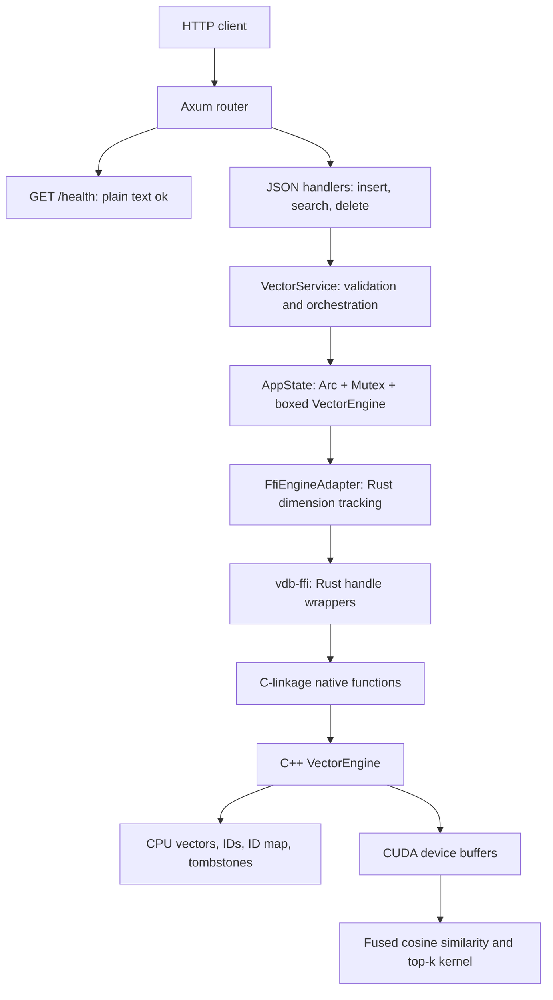
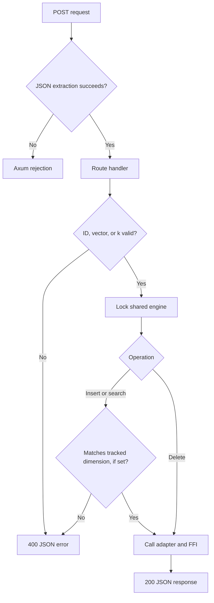
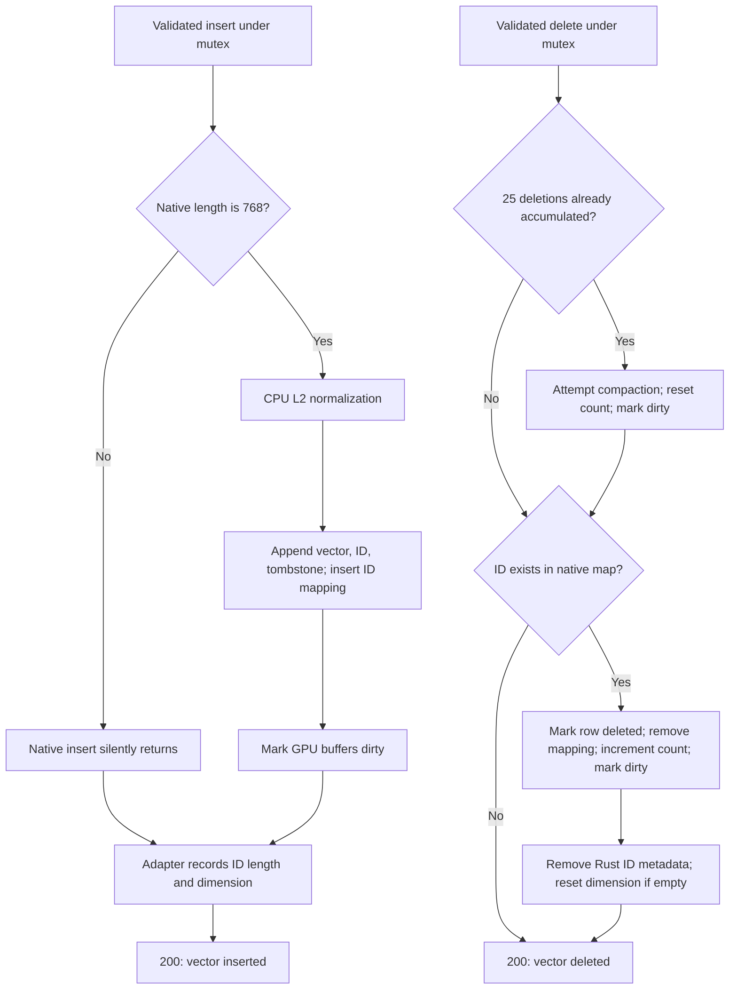

# warpDB

A vector store with a Rust API, C++ storage engine, and CUDA cosine-similarity search. Its search kernel scans stored vectors and maintains a WarpSelect top-k list within a GPU warp.

## Repository map

| Path | Responsibility |
| --- | --- |
| [`crates/basic-api`](crates/basic-api/src/main.rs) | Axum/Tokio server: routes, JSON models, validation, shared state, and engine adapter. |
| [`crates/vdb-ffi`](crates/vdb-ffi/src/engine.rs) | Rust wrappers for FFI using generated `bindgen` declarations and C++ compilation. |
| [`cpp`](cpp/vector_engine.cpp) | Normalized vector storage, ID lookup, tombstones, GPU synchronization, and search logic. |
| [`kernels`](kernels/cosine_search.cu) | Cosine/top-k search, standalone L2 normalization and dot products, kernel tests, and benchmark source. |
| [`cpp/tests`](cpp/tests/Makefile) | Native engine tests and a compilation script. |

## Architecture

Startup creates one engine and binds to **`127.0.0.1:3000`**.

Insert, search, and delete each hold the same `std::sync::Mutex` while invoking the engine.

### Validation and errors

## Storage and request flows

### Insert and delete

Duplicate insertion appends another row while preserving the original ID mapping, so deleting that ID tombstones only the mapped row. 

## Development layout

`basic-api` depends on `vdb-ffi` by path. The FFI build script uses `cc` to compile C++ and `bindgen` to generate Rust declarations from `vector_engine_ffi.h`.

The API entry point is `crates/basic-api/src/main.rs`. Running the complete stack requires an NVIDIA CUDA-capable GPU, CUDA toolkit/runtime, a compatible C++17 compiler, Rust/Cargo, and Clang/libclang.